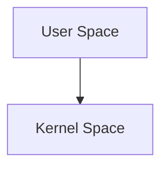

<div align="center" >

</div>

<p align="center">
<!--- BADGE GITHUB --->
</p>

> [!NOTE]
>
> This project is currently under development ! :hammer_and_wrench:
>
> *By [@jclermonttt]*.

## 🎯 Project Objectives

The goal of [Azoth] is to resolve the historical trade-off between **speed** and **security**.

1. **Context Latency Elimination:** - Use Software Isolation (SFI) via WebAssembly to avoid expensive hardware context switches.

- Achieve inter-process communication (IPC) speed close to native function call speed.

2. **Security through Proof:**

- Guarantee memory integrity using Rust's ownership system.

- Reduce the attack surface by maintaining a minimalist **[Athanor]** kernel (Principle of Least Privilege).

3. **Hardware Independence:**

- Maintain complete abstraction, allowing the same OS to boot on a PC (x86_64) or a mobile device (ARM).

4.  **Modular Ecosystem:**
    Enable the development of drivers and services in any language that can be compiled into Wasm, while ensuring they cannot crash the system. 5. **Sovereignty and Privacy (Privacy by Design):**

- **Granular Isolation:** Each sensor (microphone, camera, GPS) has its own isolated module. Access is physically revoked by [Athanor] as soon as it is no longer needed.

- **Hardware Anti-Tracking:** Minimize side-channel information leakage between applications through Wasm isolation.

- **Zero Unwanted Persistence:** Ability to instantly reset the memory state of a suspicious service without restarting the system.


## ⚡ Azoth vs Architecture Classique

 ```mermaid
graph TD
    A[User Space] --> B[Kernel Space]
```

  Si GitHub n'affiche que du code brut (texte) ou un carré vide, c'est généralement dû à l'oubli du mot-clé de langage ou à une erreur de syntaxe que le moteur de rendu de GitHub ne supporte pas.
Voici 3 solutions pour régler ça, de la plus simple à la plus robuste.
Solution 1 : Vérifier la balise "mermaid" (Erreur fréquente)
Assurez-vous que vous n'avez pas juste mis trois accents graves (```), mais bien ```mermaid collé au début.
Le code dans votre fichier doit ressembler exactement à ça :


Solution 2 : La version simplifiée (Sans styles CSS)
Parfois, GitHub a du mal avec les définitions de styles complexes (classDef) à l'intérieur du Markdown. Essayons une version purement structurelle qui passe partout :
```mermaid
graph TD
    subgraph US [📱 ESPACE UTILISATEUR]
        direction LR
        A[App A Wasm]
        B[Pilote GPU Wasm]
        C[Système Fichiers]
    end

    IPC[🚀 Zéro-Copie IPC / Shared Memory]

    subgraph KS [🛡️ NOYAU ATHANOR]
        direction TB
        K1[Gestionnaire Mémoire] --- K2[Ordonnanceur]
        K3[IPC Dispatcher] --- K4[Interruptions]
    end

    HW[💻 MATÉRIEL - x86_64 / ARM64]

    US ==> IPC
    IPC ==> KS
    KS ==> HW


```markdown
![Architecture Azoth](https://mermaid.ink/img/pako:eNp1k09v2zAMxb8K0VMBG-gPcw8dCqzTdhqwFHvoQZGtKDYlU6KoNA2C_O6j5CROF-wlkeL3SPyIlGdWSmfk-Wv1Y_Wz_jB6e1u9G29vR_f91-h2s1EwG-Wc0d6M9k_v343eF0Zbo5xzq_U6eZ78d_I_-e_k3_x_43n_Y_Xn48e24K3W4LwG76X-9-Vj8x_wViu93eWCSrSgYJmC5SksR-E1LJuC5Rksx2AVhaqgG515B80G-g5a6KFD30MXeujR99CjHnr0A_SohwH9AEPoYUA_wBB6GNEPMIQeRgwDjKCHEcMAI-hhxDDAGHoYMQwwge6hX8AYdI8tXMBEuocWLmAi3UMLFzCR7qGFC5hI99D6BUyke2j9AibSPbR-ARPpHlq_gIl0D61bwES6h9YtYCLdQ-sWMJHuoXULmEj30LoFTKR7aO0CJtI9tHYBE-keWruAiXQPrV3ARLqH1i5gIt1Da17AlLqH1ryAKXUPrXkBU-oeWvMCptQ9tOYFTKl7aK0LmFL30FoXMKXuobUuYErdQ2tdwJS6h9a6gCl1D611AVPqHlrrAqbUPbT2BUype2jtC5hS99DaFzCl7qG1L2BK3UNrX8CUuofWvoApdQ-t8wKm1D20zguYUvfQOi9gSt1D67yAKXUPbaC0gCl1D22gtIApdQ9toLSASd1DGygNMIF-gC00UFrAjH4H20IHpQXM6QfYFjooLWAh_QDbQg-lBcx999AvYAk99AvYQv8A_QJ20D9Av4A99A_QLOAA_QM0CzhC_wDNAo7RP0CzgGP0D9As4AT9AzQLOEH_AM0CTtA_QLOAU_QP0CzgFP0DNAv4DP0DNAv4DP0DNAv4DP0DNAv4DP0DtA-wZ_0A7QPsWT9A-wB71g_QPsCe9QO0D7Bn_QDtA-xZP0D7AHvWD9A-wJ71A7QPsGf9AO0D7Fk_QPsAe9YP0D7AnvUDtA-wZ_0A7QPsWT9A-wB71g_QPsCe9QO0D7Bn_QDtA-xZP0D7AHvWD9A-wJ71A7QPsGf9AO0D7Fk_QPsAe9YP0D7AnvUDtA-wZ_0A7QPsWT9A-wB71g_QPsCe9QO0D7Bn_QDtA-xZP0D7AHvWD9A-wJ71A7QPsGf9AO0D7Fk_QPsAex_9A_r9A2c?type=png)
```
  
## 🛤️ Roadmap

### Phase 1: La Genèse (Athanor)

- [x] Configuration de l'environnement Rust (no_std).
- [ ] Bootloader (UEFI/BIOS) minimal.
- [ ] Gestion des interruptions (IDT) et exceptions.
- [ ] Allocateur de mémoire physique et virtuelle.

### Phase 2: L'Écosystème (Wasm)

- [ ] Intégration du runtime Wasm (ex: Wasm3 ou interpréteur maison).
- [ ] Système d'appels système (Syscalls) pour les modules Wasm.
- [ ] Premier pilote "Hello World" en Wasm.

### Phase 3: L'Interface (Userland)

- [ ] Système de fichiers virtuel (VFS).
- [ ] Shell graphique minimal.

[Azoth]: https://github.com/azoth-os/azoth/
[Athanor]: https://github.com/azoth-os/athanor/
[@jclermonttt]: http://github.com/jclermonttt
