<!--- BADGE GITHUB --->

> [!NOTE]
>
> This project is currently under development ! :hammer_and_wrench:
>
> *By [@jclermonttt]*.

## 🎯 Project Objectives

The goal of [Azoth] is to resolve the historical trade-off between **speed** and **security**.

1. **Context Latency Elimination:** - Use Software Isolation (SFI) via WebAssembly to avoid expensive hardware context switches.

- Achieve inter-process communication (IPC) speed close to native function call speed.

2. **Security through Proof:**

- Guarantee memory integrity using Rust's ownership system.

- Reduce the attack surface by maintaining a minimalist **[Athanor]** kernel (Principle of Least Privilege).

3. **Hardware Independence:**

- Maintain complete abstraction, allowing the same OS to boot on a PC (x86_64) or a mobile device (ARM).

4.  **Modular Ecosystem:**
    Enable the development of drivers and services in any language that can be compiled into Wasm, while ensuring they cannot crash the system. 5. **Sovereignty and Privacy (Privacy by Design):**

- **Granular Isolation:** Each sensor (microphone, camera, GPS) has its own isolated module. Access is physically revoked by [Athanor] as soon as it is no longer needed.

- **Hardware Anti-Tracking:** Minimize side-channel information leakage between applications through Wasm isolation.

- **Zero Unwanted Persistence:** Ability to instantly reset the memory state of a suspicious service without restarting the system.

## ⚡ Azoth vs Architecture Classique

```mermaid
flowchart TD
    %% Définition des styles
    classDef space fill:#e1f5fe,stroke:#01579b,stroke-width:2px;
    classDef ipc fill:#fff9c4,stroke:#fbc02d,stroke-width:2px,stroke-dasharray: 5 5;
    classDef kernel fill:#ffebee,stroke:#b71c1c,stroke-width:2px;
    classDef hardware fill:#424242,stroke:#000000,stroke-width:2px,color:#fff;

    %% Espace Utilisateur
    subgraph US ["📱 ESPACE UTILISATEUR (User Space)"]
        direction LR
        A["App A<br>(Wasm)"]
        B["Pilote GPU<br>(Wasm)"]
        C["Système de<br>Fichiers"]
    end

    %% IPC au milieu
    IPC["🚀 Zéro-Copie IPC<br>(Shared Memory)"]

    %% Noyau
    subgraph KS ["🛡️ NOYAU ATHANOR (Kernel Space)"]
        direction TB
        K1["Gestionnaire de Mémoire"] --- K2["Ordonnanceur"]
        K3["IPC Dispatcher"] --- K4["Interruptions"]
    end

    %% Matériel
    HW["💻 MATÉRIEL<br>(x86_64 / ARM64 / RISC-V)"]

    %% Connexions
    US ==> IPC
    IPC ==> KS
    KS ==> HW

    %% Application des styles
    class US space
    class IPC ipc
    class KS kernel
    class HW hardware
```

  
## 🛤️ Roadmap

### Phase 1: La Genèse (Athanor)

- [x] Configuration de l'environnement Rust (no_std).
- [ ] Bootloader (UEFI/BIOS) minimal.
- [ ] Gestion des interruptions (IDT) et exceptions.
- [ ] Allocateur de mémoire physique et virtuelle.

### Phase 2: L'Écosystème (Wasm)

- [ ] Intégration du runtime Wasm (ex: Wasm3 ou interpréteur maison).
- [ ] Système d'appels système (Syscalls) pour les modules Wasm.
- [ ] Premier pilote "Hello World" en Wasm.

### Phase 3: L'Interface (Userland)

- [ ] Système de fichiers virtuel (VFS).
- [ ] Shell graphique minimal.

[Azoth]: https://github.com/azoth-os/azoth/
[Athanor]: https://github.com/azoth-os/athanor/
[@jclermonttt]: http://github.com/jclermonttt
